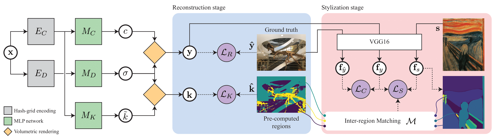

# Locally Stylized Neural Radiance Fields




## Description

Source code for the paper "Locally Stylized Neural Radiance Fields". ([arxiv](https://arxiv.org/abs/2309.10684))

## Setup

**Python environment**

Code is tested with a single NVIDIA RTX 3090 GPU, using Python 3.10, PyTorch 2.0 and CUDA 11.7.


```bash
# Setup conda env
conda create --name nerfstyle python=3.10
conda activate nerfstyle

# Install PyTorch (CUDA 11.7)
conda install pytorch torchvision torchaudio pytorch-cuda=11.7 -c pytorch -c nvidia

# Install tiny-cuda-nn
pip install git+https://github.com/NVlabs/tiny-cuda-nn/#subdirectory=bindings/torch

# Install other dependencies
pip install dacite simple_parsing pyyaml ipykernel tabulate einops GitPython matplotlib torch-ema urllib3 idna certifi oauthlib google-auth werkzeug ninja imageio
```

**Training datasets**

- [LLFF dataset](docs/llff_dataset.md)
- Replica dataset (to be updated)

**Style images and segementations**

Segmentations of style images are computed using [Segment Anything](https://github.com/facebookresearch/segment-anything). Precomputed segmentations for some of the style images are provided [here](https://www.dropbox.com/scl/fo/nx3ofutiaso6ublvo0d7v/h?rlkey=m2n795vqmdzhumc8zfb6tr18r&dl=0).

## Usage

**Reconstruction stage**

Trains the base NeRF model and classification network.

```bash
mkdir runs
python train.py --log-dir runs/room_base --data-cfg cfgs/dataset/llff_room.yaml

# Train with sparsity regulation
python train.py --log-dir runs/room_base --data-cfg cfgs/dataset/llff_room.yaml  --sparsity_lambda 0.01
```
*Sparsity regulation* encourages the radiance field to minimize the predicted density in areas that correspond to empty space. It gives the stylization result a more "solid" effect. 

**Stylization stage**

```bash
python train.py --log-dir runs/room_scream --ckpt <path_to_recon_stage_ckpt> --style-image <style_img>.jpg --style-seg-path <style_img>.npz  --max-steps 512
```

**Inference**

```bash
python render.py <path_to_stylization_stage_ckpt>
```