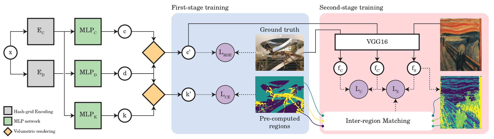

# Locally Stylized Neural Radiance Fields




## Description

Source code for the paper "Locally Stylized Neural Radiance Fields".

## Setup

**Python environment**

Code is tested with a single NVIDIA RTX 3090 GPU, using Python 3.8, PyTorch 1.12 and CUDA 11.3.

Setup instructions will be provided later.

**Training datasets**

- [LLFF dataset](docs/llff_dataset.md)
- Replica dataset (to be updated)

**Style images and segementations**

Segmentations of style images are computed using [Segment Anything](https://github.com/facebookresearch/segment-anything). Precomputed segmentations for some of the style images are provided below.

- `scream` (image | segmentation)

## Usage

**Stage 1: Training the base NeRF model and classification network**

```bash
mkdir runs
python train.py --log-dir runs/room_base --data-cfg cfgs/dataset/llff_room.yaml
```

**Stage 2: Style transfer**

```bash
python train.py --log-dir runs/room_scream --ckpt <path_to_stage_1_ckpt> --style-image style_images/scream.jpg --style-seg-path style_segs/scream.npz

# Override default matching with manual one
python train.py --log-dir runs/room_scream --ckpt <path_to_stage_1_ckpt> --style-image style_images/scream.jpg --style-seg-path style_segs/scream.npz --style-matching 7,13,2
```
